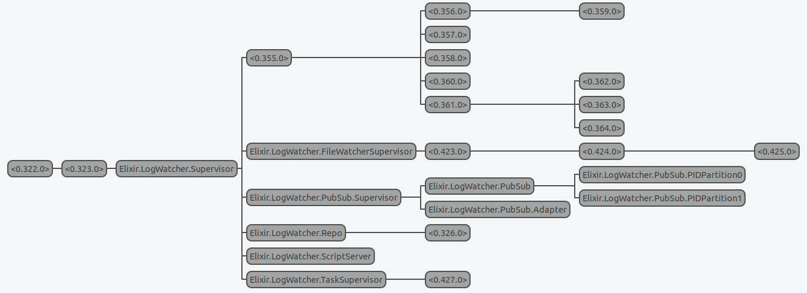

# LogWatcher

Consists of an Oban-compatible `TaskStarter` worker module that can
shell out to Rscripts which produce JSON-formatted log files.

Meanwhile the `FileWatcher` module uses inotify tools to monitor
the primary task log file for changes and broadcasts events on
a session topic.

## Sessions and Tasks

The idea is that a session is location on the filesystem that 
contains executable shell scripts, data, and log files.

Each invocation of a shell script is called a task. Tasks may
read and write data, and record events, state changes, and
results in log files.

Sessions and tasks are identified by IDs that are assigned on the 
Elixir side.


## JSON data and log files

The following list of files are located in a session subdirectory, 
called the `session_log_path`. They all use JSON encoding to record
state changes and results. The `jsonl` (and archived `jsonx`) files use 
the [JSON Lines](https://jsonlines.org/) format, while the `json`
files are regular JSON files.


### Log files

Log files in the `session_log_path` have well-known names, 
based on the session and task IDs, the task type, and the gen
number:

* session_id-sesslog.jsonl - Records session events, including task starts 
  and completions.
* task_id-task_type-gen-log.jsonl - Active task progress log. Each line 
  contains timestamp, task info, phase, state, progress_completed, 
  progress_total, message)
* task_id-task_type-gen-log.jsonx - Task progress log after it has been archived.
* task_id-task_type-gen-start.json - Task start file. Contains task info,
  started_at, os_pid, status, start result or errors.
* task_id-task_type-gen-result.json - Task result file. Contains task info
  completed_at, os_pid, status, completion result or errors.


### Arguments file

There is one file with a well-known name that the Elixir side
places in the `session_log_path` directory:

* task_id-gen-task_type-arg.json - Task arguments file, written by
  the Elixir side before the task script is run.


## Ecto.Changeset-compatible database of Sessions and Tasks

The `LogWatcher.Tasks` context module can perform a limited number
of read-only database-like operations, using the log files located in 
the `session_log_path` directory, and returning data in 
`LogWatcher.Tasks.Session` and `LogWatcher.Tasks.Task` structs.

There is one mutation method, which "archives" a task, by renaming the 
task's `log.jsonl` file to `log.jsonx`.


## Task status

Before running the shell script, the `TaskStarter` module places the
JSON-encoded arguments file for the task in the `session_log_path` 
directory.

Then the task's shell script is invoked with standard command line 
options specifying the `session_id`, `session_log_path`, `task_id`, 
`task_type`, and `gen` number.

The shell script (current either Rscript or Python) is responsible for 
parsing arguments from the command line and from the arguments file.

While running, a task progresses through seven well-known phases, 
identified by the `status` item in the `LogWatcher.Tasks.Task` struct:

1. "initializing" - This initial phase comes before command line arguments
  have been parsed and the log file system established. Any errors thrown
  in this phase have to be recovered from the standard output 
  (also JSON-encoded) of the script. If no runtime errors (exceptions) 
  occur, we do not create a log file but pass directly to the next phase:
2. "created" - The first entry in the log file has been written, and
  therefore, the FileWatcher has been notified. If no exceptions 
  occur, we pass to the next phase:
3. "reading" - The task is parsing the JSON-encoded arguments file.
  If no exceptions occur, we pass to the next phase:
4. "validating" - The task is validating the command line and file-based
  arguments. Validation may produce exceptions or non-fatal errors
  such as those produced when arguments do not conform to the 
  current state of the session, or if performing the task is not 
  permitted while other operations are in progress.
  If no exceptions occur, we pass to the next phase:
5. "running" - The task is performing what could be a long-term 
  process. A start file is also written, recording the parsed
  arguments and the time that execution started. The TaskStarter 
  process is sent a `:task_started` message when the FileWatcher 
  parses the first log message written in a "running", "cancelled", 
  or "completed" phase. Normal execution will pass to either the 
  "cancelled" or "completed" phase.
6. "cancelled" - The task system received a message to cancel
  the current task.  If the task can be halted, or happens to 
  fail before it can be halted the phase is set to "cancelled". 
  The log file may contain errors, but a valid result file will 
  never be written for tasks that exit in the "cancelled" state.
  If the task manages to complete successfully, despite the 
  cancellation request we pass to the next phase:
7. "completed" - The task script was able to complete, whether
  or not a cancellation request was received. The log file may 
  contain errors. If no errors were encountered, a result file is 
  also written, and the log file will include a pointer
  to the result file.


## Exceptions and cancellations

The Python and Rscript examples will catch any exception
generated while the task is running, convert it into
a structured error, set the task status to "completed", 
and exit.

The Python and Rscript examples also trap the SIGINT
Unix process signal, convert it into a structured error,
set the task status to "cancelled", and exit. 

There is testing support on the Elixir side to generate
errors, and to send a "kill -s SIGINT" cancellation message
to a running task.

In a real world system, a task that receives the SIGINT
system will need to clean up and restore any non-log
session data to the state it was prior to the task being
run.

Note: Oban will send an exit signal to a running worker when
a job is canceled, but only if PostgreSQL notifications are 
active. In the test environment, we must manually send a 
"cancel_script" message to the `LogWatcher.ScriptServer`.


## Oban compatibility

The `TaskStarter` module implements the `Oban.Worker`
behaviour, so that a `LogWatcher.Tasks.Task` can be
started using Oban's scheduling sytem. Tasks that
encounter exceptions or script-generated errors, return an 
`{:ok, result}` tuple, since they are expected to complete 
(writing errors to the log file).

Tasks that cannot be started, or have other structural
problems, return a `{:discard, result}` tuple
so that Oban will not attempt to re-run them.

## Supervision tree and processes



This tree below annotates the diagram above.

```
0.322.0 - application_master.init
  0.323.0 - application_master.start_it
    LogWatcher.Supervisor
      0.355.0 - Oban
        0.356.0 - Oban.PostgresNotifier
          0.359.0 - Postgrex.Notifications
        0.357.0 - Oban.Midwife
        0.358.0 - Oban.Plugins.Pruner
        0.360.0 - Oban.Plugins.Stager
        0.361.0 - Oban.Queue.Supervisor
          0.362.0 - Task.Supervisor
          0.363.0 - Oban.Queue.Producer
          0.364.0 - Oban.Queue.Watchman
      LogWatcher.FileWatcherSupervisor
        0.423.0 - LogWatcher.FileWatcher
          0.424.0 - FileSystem.Worker
            0.425.0 - FileSystem.Backends.FSInotify
      LogWatcher.PubSubSupervisor
        LogWatcher.PubSub
          LogWatcher.PubSub.PIDPartition0
          LogWatcher.PubSub.PIDPartition1
        LogWatcher.PubSub.Adapter
      LogWatcher.Repo
        0.326.0 - DBConnection.ConnectionPool
      LogWatcher.ScriptServer
      LogWatcher.TaskSupervisor
        0.427.0 - Task [monitored by LogWatcher.ScriptServer]
```